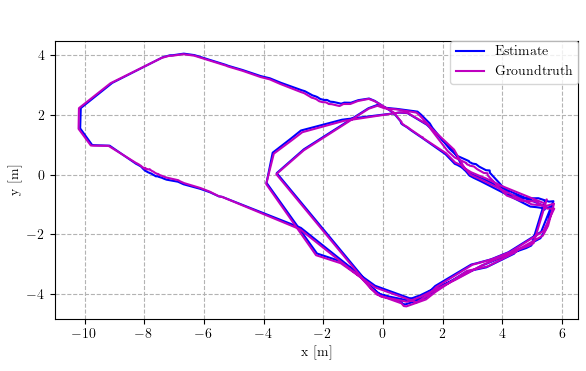
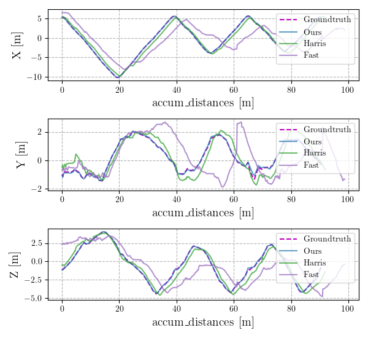
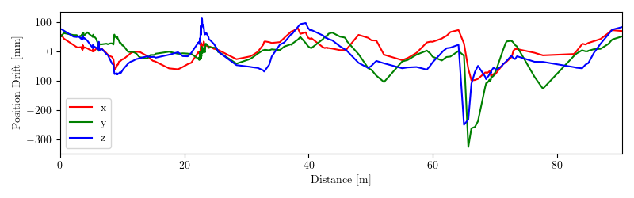
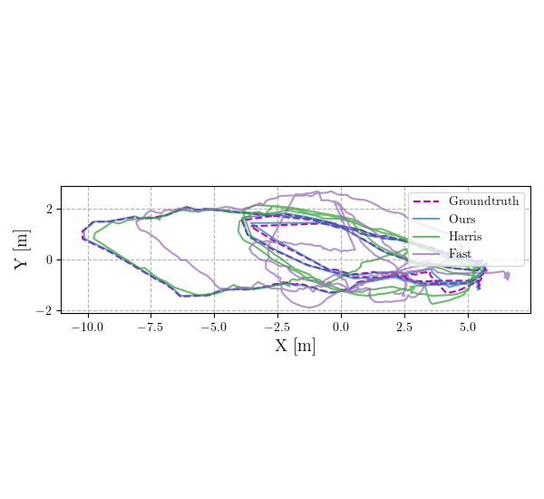

# Trajectory Evaluate Tools for SLAM Estimate Result

A trajectory evaluate tool for SLAM estimate result, modify from [rpg_traj_eval](https://github.com/uzh-rpg/rpg_trajectory_evaluation).

# Example

```shell
# evaluate multi traj
python3 ./eval_traj_random.py ./examples/multi_traj_example ./output
# evaluate single traj
python3 ./eval_single_traj.py ./examples
# evaluate euroc bach
python3 ./eval_euroc_bech.py ./examples/euroc ./input/euroc ./output/euroc_bech.pdf
```

<table>
    <tr>
        <td><center></center><center></center></td>
        <td><center></center><center></center></td>
    </tr>
    <tr>
        <td><center></center><center></center></td>
        <td><center></center><center></center></td>
    </tr>
</table>

# Reference
```shell
@ARTICLE{umeyama,
  author={Umeyama, S.},
  journal={IEEE Transactions on Pattern Analysis and Machine Intelligence}, 
  title={Least-squares estimation of transformation parameters between two point patterns}, 
  year={1991},
  volume={13},
  number={4},
  pages={376-380},
}
```
